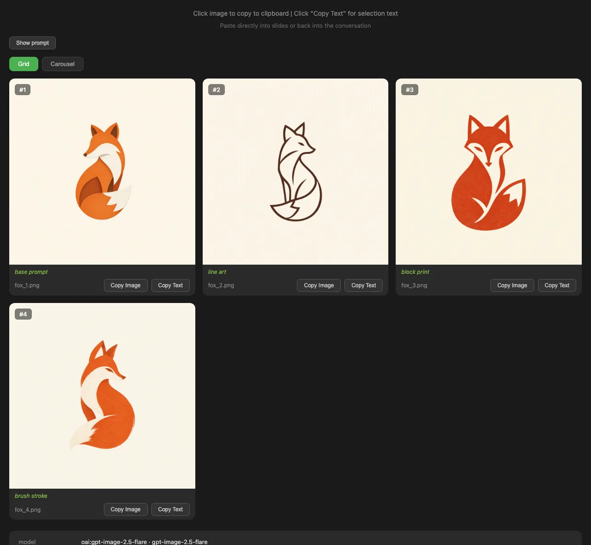

# genimg

[](https://github.com/lucharo/genimg/actions/workflows/ci.yml)
[](pyproject.toml)
[](https://pypi.org/project/genimg/)
[](LICENSE)

- One command for OpenAI and Google DeepMind [image models](https://genimg.luischav.es/reference/models/), on an API
  key or your [ChatGPT subscription through Codex](https://genimg.luischav.es/guide/codex-subscription/).
- Variations that actually differ, side by side in an [HTML grid](https://genimg.luischav.es/visual-tools/grid/), and a
  [drawing studio](https://genimg.luischav.es/visual-tools/draw-studio/) to sketch what you mean.
- [Skills](https://genimg.luischav.es/skills/) so your coding agent can do all of it.

Made for humans and agents; the agent-native design is inspired by [kenn-io](https://github.com/kenn-io)'s
[roborev](https://github.com/kenn-io/roborev) and [agentsview](https://github.com/kenn-io/agentsview).

**Docs: [genimg.luischav.es](https://genimg.luischav.es/)**

```bash
uv tool install genimg
genimg setup                      # connect a provider and save a profile
genimg "a minimal fox logo, NOT a grid" \
  --model oai:gi2.5-flare \
  --num 4 \
  --deltas "line art, block print, brush stroke" \
  --output fox.png \
  --grid \
  --open
```



Add the skills to Claude Code, Codex, Cursor or OpenCode with `npx skills add lucharo/genimg`:
`genimg` plus workflows for infographics, visual exploration, visual review and image-to-app.
Pick some with `--skill`, e.g. `npx skills add lucharo/genimg --skill genimg genimg-infographic`.

## Docs

- [Getting started](https://genimg.luischav.es/getting-started/): install, providers, first image
- [For agents](https://genimg.luischav.es/agents/): the skills and what an agent can read
- [Guide](https://genimg.luischav.es/guide/diversity/): diverse images, input images, Codex
- [Reference](https://genimg.luischav.es/reference/cli/): CLI, models, config.toml

## Contributing

`uv sync`, then `uv run pytest` and `uv run ruff check .`. See [CONTRIBUTING.md](CONTRIBUTING.md)
and the [maintainer docs](https://genimg.luischav.es/maintainers/).
