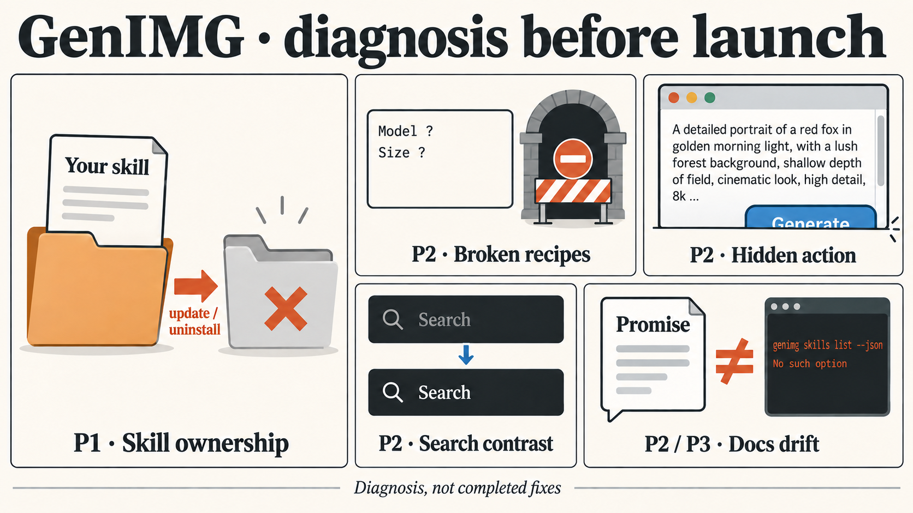

# GenIMG visual diagnosis

**Start with [the eight-page illustrated review](2026-09-21-genimg-diagnosis.html).** Download/open the HTML in a browser; all nine displayed images are embedded. GitHub's source view does not execute HTML.

**Next: [#5 — preserve user-owned skills](https://github.com/lucharo/genimg/issues/5).** The findings are diagnosed, not fixed. Publication stays held.

See the [handoff](../../../handoffs/2026-09-24-genimg-review.md) and [ticket snapshot](tickets.md). The live tickets own status; this bundle preserves the review evidence.

Contents, provenance and verification

- `infographic/`: six selected explanations, with their prompts and source notes.
- `superseded/`: three earlier generated renders retained for provenance. They contain errors corrected in the selected versions; do not use them as evidence.
- `shots/`: two real product captures and two review captures. All four retain historical `.png` names despite JPEG payloads; use file signatures when loading them.
- `evidence/`: original CLI/surface results, skill file comparisons, product review and history fixture.
- `QA.md`: dated visual QA of the original review, with its coverage limits.
- `preservation.json`: original HTML hash and the portable-copy transformation.
- `SHA256SUMS`: checksums for the portable bundle, excluding this checksum file itself.

Only textual machine-local paths and private hosting references were sanitised. Image bytes, explanations and diagnoses were preserved. Generated diagrams are explanatory; screenshots and probe results establish observed behaviour. The original overview showed 76 DOM words plus approximately 70 raster words, about 40 seconds of reading; detail stays behind evidence buttons.

Verify from this directory with `shasum -a 256 -c SHA256SUMS`. The portable copy was checked for valid embedded images, resolvable local links and absence of local-host dependencies. Its previously verified controls and template are unchanged. See [portable verification](portable-verification.json).

---

Reviewed 20–21 September; preserved 24 September 2026, Europe/London.
