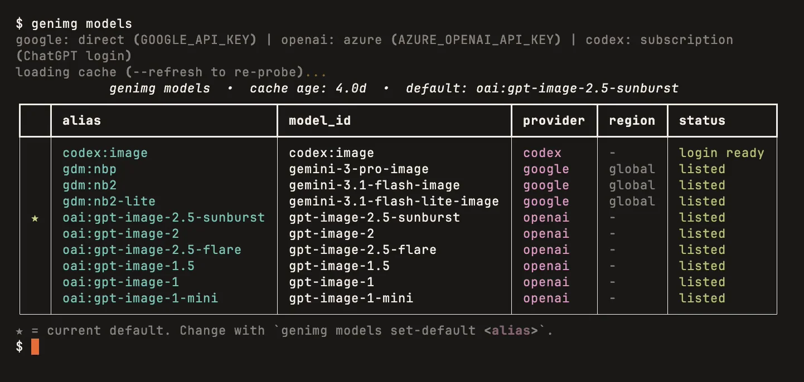

# Getting started

## Install

```bash
uv tool install genimg
genimg --version
```

Needs [uv](https://docs.astral.sh/uv/) and Python 3.11 to 3.14. Upgrade with
`uv tool upgrade genimg`.

## Which providers you can reach

You need at least one of these.

| Route | Auth mode | What you need |
| --- | --- | --- |
| OpenAI via its own API | `direct` | `OPENAI_API_KEY` |
| OpenAI via Azure OpenAI | `azure` | `AZURE_OPENAI_API_KEY`<br>`AZURE_OPENAI_ENDPOINT` |
| Google via a Gemini API key | `direct` | `GEMINI_API_KEY` or `GOOGLE_API_KEY` |
| Google via GCP Vertex AI | `vertex` | `GOOGLE_APPLICATION_CREDENTIALS` |
| Codex with a ChatGPT subscription | `subscription` | the [Codex CLI](guide/codex-subscription.md) and `codex login` |

For Vertex, point that variable at a service-account JSON, or use
`gcloud auth application-default login` (the `vertex_adc` mode).
`genimg auth --modes` prints every mode from your installed version.

## Connect

```bash
genimg setup
```

<!-- Zensical rewrites a video's src relative to this file but leaves poster relative to the page URL. -->

??? example "Watch the wizard"

    <video src="assets/demos/setup.mp4" poster="../assets/demos/setup.webp" controls preload="none" loop muted playsinline title="genimg setup picking the Gemini key, the OpenAI key and Codex, then a default model"></video>

The wizard finds credentials already in your environment and checks each provider with a free
live call. It saves a profile only when that check passes. Keys stay in your environment; only
settings such as an Azure endpoint go to [config.toml](reference/config.md).

Without a terminal (your agent, CI) `genimg setup` asks nothing: it saves each provider whose key
is in the environment and passes the check, and exits `1` if none does. `--model gdm:nb2` also
saves a default.

Check the result at any time. Neither command generates an image:

```bash
genimg auth      # one row per provider: mode, credential, ready
genimg models    # which models each provider lists for your credentials
```



## Pick a model

genimg has no built-in default model. Pass `-m`, or save a default.

| Alias | Provider | Use it for |
| --- | --- | --- |
| `gdm:nb2` | Google | Fast, cheap exploration; follows layouts and diagrams well |
| `gdm:nbp` | Google | Photographic and painterly quality |
| `gdm:nb2-lite` | Google | The cheapest Gemini model, 1K only |
| `oai:gi2` | OpenAI | Legible text, logos and UI |
| `oai:gi2.5` | OpenAI | GPT Image 2.5: cheaper than `oai:gi2`, adds `xhigh` and `max` quality |
| `oai:gi2.5-flare` | OpenAI | GPT Image 2.5 Flare, same quality levels |
| `codex:image` | Codex | Your ChatGPT subscription, no API key; Codex picks the model |

Older models and every alias are in the [models reference](reference/models.md).

```bash
genimg models set-default gdm:nb2
```

## Your first image

Preview the request first. `--dry-run` shows the model, cost and output path without calling
the API:

```bash
genimg "a paper-cut fox in a birch forest, warm palette" \
  --model gdm:nb2 \
  --output fox.png \
  --dry-run
```

```text
genimg google/direct@google gdm:nb2 → gemini-3.1-flash-image
  prompt   "a paper-cut fox in a birch forest, warm palette"
  params   n=1
  cost     $0.0670 (estimate)  id=20260925_120805_48c7fa
  output   fox.png
dry-run: no API call made.
```

??? example "Watch a dry run of the four takes on the home page"

    <video src="assets/demos/dry-run.mp4" poster="../assets/demos/dry-run.webp" controls preload="none" loop muted playsinline title="genimg --dry-run planning four fox logos and a grid"></video>

The first line reads provider, auth mode, profile, alias and model id. Drop `--dry-run` to
generate:

```bash
genimg "a paper-cut fox in a birch forest, warm palette" \
  --model gdm:nb2 \
  --output fox.png
```

Every run is recorded. `genimg history` lists past generations and `genimg cost` totals the
estimated spend.

Next: [get several different takes](guide/diversity.md), or let your
[coding agent](agents.md) drive genimg.
