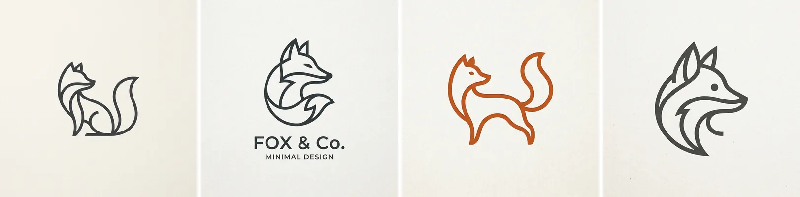
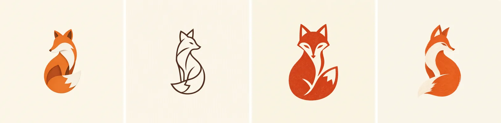
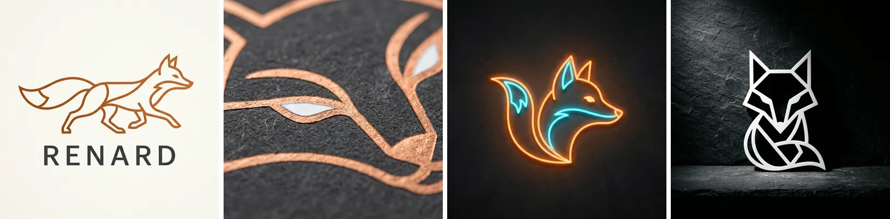

# Diverse images

`-n 4` asks for four images. On a simple subject they come back nearly identical:

<figure markdown>
  { width="720" }
  <figcaption><code>genimg "a SINGLE minimal fox logo, NOT a grid" -m gdm:nb2 -n 4 -g</code></figcaption>
</figure>

Two flags spread them out.

## Name the styles: `--deltas`

```bash
genimg "a minimal fox logo, NOT a grid" -m oai:gi2.5-flare -n 4 \
  --deltas "line art, block print, brush stroke" -g --open
```

<figure markdown>
  { width="720" }
  <figcaption>Take #1 keeps the base prompt. Takes #2 to #4 get one delta each, in order.</figcaption>
</figure>

Pass one delta fewer than `-n`, comma-separated or as `--deltas @styles.txt` with one per line.
It works on every provider. Use it for diagrams and photos too.

## Let genimg pick: `-d`

```bash
genimg "a SINGLE minimal fox logo, NOT a grid" -m gdm:nb2 -n 4 -d -g --open
```

<figure markdown>
  { width="720" }
  <figcaption>Takes #2 to #4 drew close-up framing, neon glow and dramatic lighting from the built-in pool.</figcaption>
</figure>

`-d` picks deltas from a built-in pool that suits illustrations and logos, so each run differs.
On Gemini, `--mode batch` sends one request instead and the model varies its own takes:

```bash
genimg "a minimal fox logo, NOT a grid" -m gdm:nb2 -n 4 -d --mode batch -g --open
```

## Rules of thumb

- Both need `-n 2` or more.
- `--mode batch` is Gemini only. On OpenAI genimg rejects it, because batched takes come back as
  near-duplicates.
- `--deltas` and `--mode batch` do not combine.
- `-g --open` opens the set in the [grid](../surfaces/grid.md), with each card's delta under it.
- Found a winner? Edit it with `-i` ([Input and reference images](input-images.md)).
