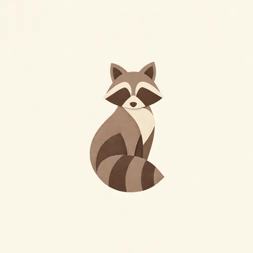

# Input and reference images

You can pass images back into genimg in two roles. They are different operations, and the
metadata sidecar and the review grid record which was which.

## Edit an image: `-i`

`-i PATH` is image-to-image. The model keeps the picture and changes what the prompt asks
for. Use it to iterate on a winner from a grid, fix one detail, or restyle a photo:

```bash
genimg "make the sky dusk, keep everything else" -i fox.png -m gdm:nb2 -o fox-dusk.png
genimg "same scene, remove the text" -i poster.png -m oai:gi2 -o poster-clean.png
```

Chain edits by feeding the last output back in. Each step is recorded with its input path,
so `genimg history` shows the lineage.

<div class="grid" markdown>
{ width="300" }
{ width="300" }
</div>

Left, the input. Right, `genimg "same logo, same style, but at dusk: deep indigo background,
warm orange rim light on the fox, keep everything else" -i fox_1.png -m oai:gi2.5-flare`.
The mark, pose and cut-paper style survive; only what the prompt named changed.

## Steer with references: positional paths

Paths after the prompt are references. They are not edited; the model uses them for style,
palette, character or layout guidance while producing a new image:

```bash
genimg "the same character, now waving, same rendering style" hero.png -m gdm:nbp -o wave.png
genimg "app icon in this visual language" brand-a.png brand-b.png -m oai:gi2 -o icon.png
```

<div class="grid" markdown>
{ width="300" }
{ width="300" }
</div>

Left, the reference. Right, `genimg "a raccoon character in exactly this paper-cut style and
palette, one centred mark" fox_1.png -m oai:gi2.5-flare`: a new subject, the style and palette
carried over, the fox itself untouched.

Order matters and is preserved: `#1`, `#2`, … in the preview and the grid. Combine both roles
in one call, edit one image with others as references:

```bash
genimg "preserve this room; apply the approved design direction" \
  approved-concept.png palette.png -i original-room.png -m gdm:nb2 -o room-v2.png
```

`--dry-run` prints the input and the ordered references before anything is sent, which is
the quickest way to confirm the roles are what you meant.

## Provider limits

| Provider | Inputs | Notes |
| --- | --- | --- |
| Google · Gemini | input and references as image parts | any common raster format |
| OpenAI · GPT Image | up to 16 images, PNG/JPG/WEBP, 50 MB each | all inputs go through the edit endpoint |
| Codex | input and references attached to the run | Codex decides how to use them |

## Multi-view work

Generating several views of one subject (a product from three angles, a UI at three
breakpoints) works best as **one edit per view from the same source**, not a chain: each
chained edit drifts a little further from the original. Keep the first approved image as the
`-i` input for every view and put the previously generated views in as references when
consistency between them matters. The [image-to-app](../skills/image-to-app.md) skill
formalises this for UI systems.
