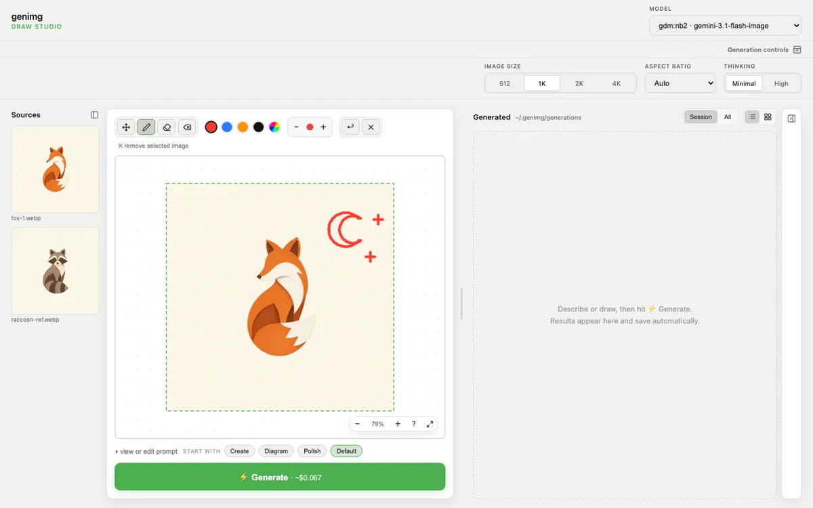
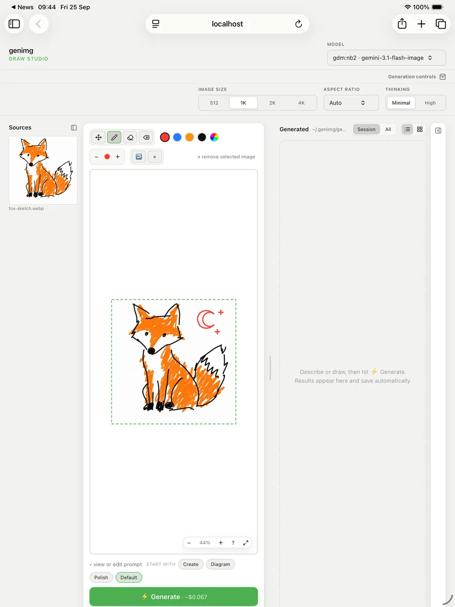

# Draw Studio

Sketch on an image, then have a model redraw it. Draw Studio is a browser canvas that genimg
serves from your own computer.

```bash
genimg draw -m oai:gi2.5 fox-sketch.webp
```

<figure markdown>
  
  <figcaption>The command above: the doodle on the canvas, one <b>Generate</b> at medium quality (about $0.013), and the result on the right.</figcaption>
</figure>

1. Click a source image to put it on the canvas, or draw on a blank one.
2. Mark what you want and describe it in the prompt.
3. **Generate** sends the canvas to the model. Put the result back on the canvas for another pass.

Results save to `~/.genimg/generations/`; **All** lists earlier ones. The controls follow the
model. **codex:image** uses your [Codex subscription](../guide/codex-subscription.md) instead
of an API key. `--no-open` prints the URL instead of opening a browser.

## Draw from an iPad

<figure markdown>
  { width="420" }
  <figcaption>The iPad Pro 13-inch simulator, which shares the Mac's localhost. The moon was drawn by touch.</figcaption>
</figure>

The Studio listens only on the Mac's loopback address, so Safari on a separate iPad cannot open
the Mac's `localhost`. Put the Mac's screen on the iPad instead:

- [Sidecar](https://support.apple.com/en-gb/102597) makes the iPad a second display. Drag the
  browser across and draw with Apple Pencil; the Studio ignores pressure.
- [Screen Sharing](https://support.apple.com/en-gb/guide/mac-help/mh11848/mac) lets a VNC app on
  the iPad control the Mac.

## Draw Studio or the CLI?

| Need | Draw Studio | CLI |
| --- | --- | --- |
| Sketch or annotate | Yes | Pass a file with `-i` |
| Several variants | One per Generate | `-n` |
| Deliberate diversity | No | `-d`, `--deltas` |
| Review grid | Generated panel | `-g`, `genimg grid` |

## Security boundary

- The server binds to `127.0.0.1` and refuses non-local Host headers and cross-site POSTs.
- Provider keys stay with genimg; the page never receives them.
- The model runs at the provider, which receives your prompt and canvas.
