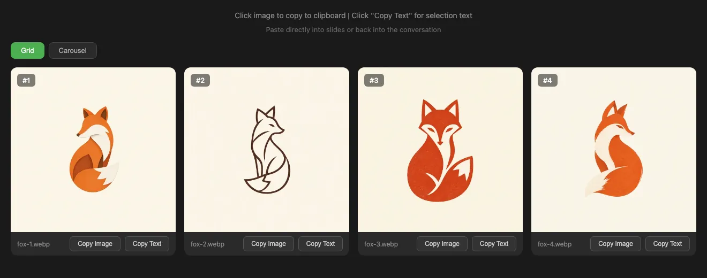
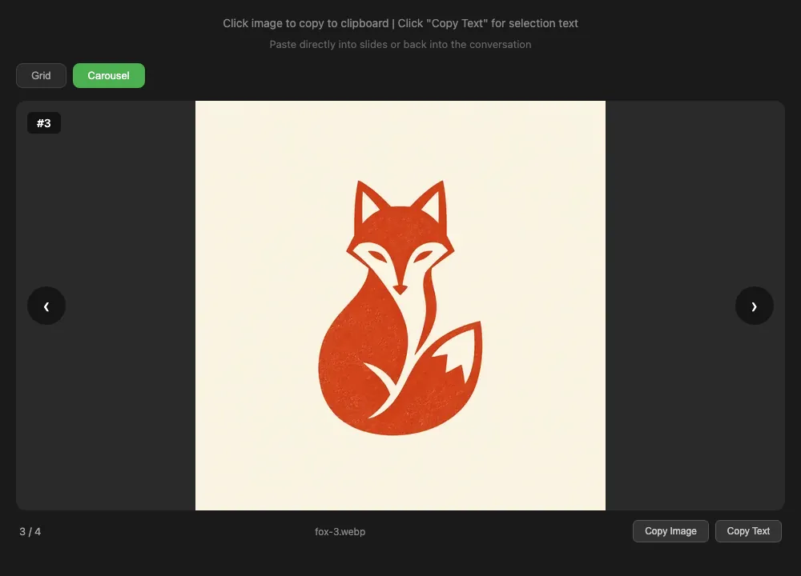
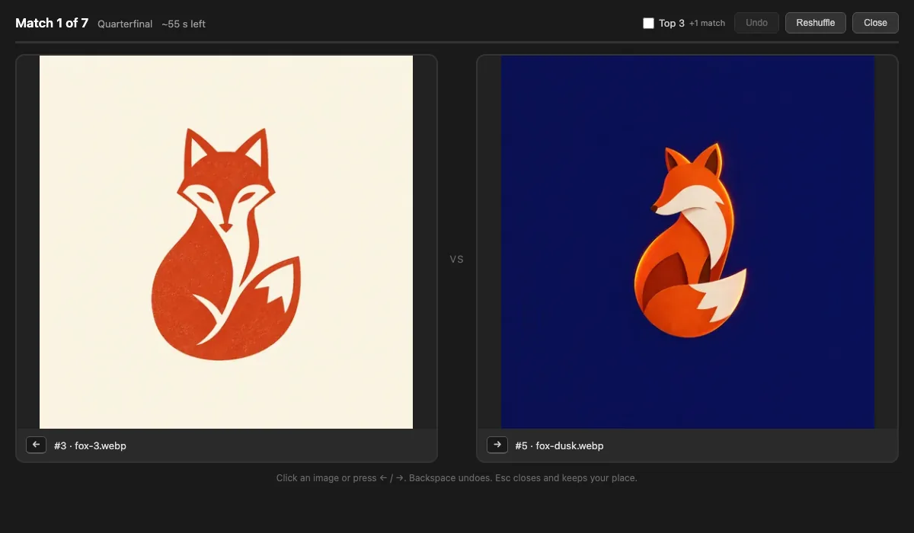

# Grid and carousel

A grid is one HTML file that shows a set of images side by side. It needs no server, so you can
open it with a double-click or send it on.

```bash
genimg grid fox-1.webp fox-2.webp fox-3.webp fox-4.webp --open
```

=== "Grid"

    

=== "Carousel"

    

**Copy Text** copies `I choose #3 (fox-3.webp)`, ready to paste back to an agent.

## Try it

This is the file the command above wrote. Switch views, or use the arrow keys.

<iframe src="../../assets/grid-demo.html?view=carousel&i=3" title="A live genimg grid of four fox logos"
  loading="lazy" allow="clipboard-write"
  style="width: 100%; height: 710px; border: 0; border-radius: 10px;"></iframe>

## Can't decide? Run a tournament

With 3 to 20 images, **Tournament** shows two at a time. Click the one you prefer, or press ← or →,
until one is left: eight images take seven picks. Tick **Top 3** for one more match, for third place.



The winners get badges on the grid and survive a reload. **Copy result (JSON)** gives an agent the
winner, the ranking and every pick, by grid number, file name and model.

## Grids from a generation

Add `-g` to write a grid with the images:

```bash
genimg "a minimal fox logo" -m oai:gi2.5-flare -n 4 -d -g --open
```

It also shows the prompt, model, estimated cost and each card's
[delta](../guide/diversity.md), and lands in `~/.genimg/grids/`.
